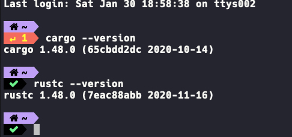

# Rust开发环境搭建

`Rust` 语言的环境配置还是相对简单的，因为官方提供了 `rustup` 这个一步配置工具，`rustup` 是 `Rust` 官方推出的基于 `终端/控制台/shell` 的工具，可用于管理 `Rust` 版本和相关工具。

## Linux和Mac下配置安装环境

`Linux`和`Mac`上配置环境比较简单，你只需要在你的终端里面执行下面命令即可安装:

```shell
curl --proto '=https' --tlsv1.2 -sSf https://sh.rustup.rs | sh
```
查看是否安装成功输入:`rustc --version`即可！




## Windows 上安装 Rust

`Windows` 上安装任何语言的开发环境都有一点复杂，`Rust` 也无法避免这一点，`Windows` 上运行 `Rust` 编译器需要 `C++` 开发环境,推荐的做法是安装 `Visual Studio 2015` 或更高的版本，然后你打[https://www.rust-lang.org/](https://www.rust-lang.org/)下载对应文件即可，双击下载好的 `rustup-init.exe` 文件，选择第`1`项，然后你就一路下一步，一般情况下，只要静静地等待安装完成即可。

`Rust` 被安装到目录 `C:\Users\{PC}\.cargo\bin` 里打开你自己的 `C:\Users\{PC}\.cargo\bin` 目录，可以看到下面的文件列表。

```shell
cargo-fmt.exe
cargo.exe
rls.exe
rust-gdb.exe
rust-lldb.exe
rustc.exe // 这是rust编译器
rustdoc.exe
rustfmt.exe
rustup.exe
```
你也可以把这个目录添加到你系统环境变量里，如果在安装出现了问题你可以加`关于本站`上的讨论组，进来讨论你遇到的问题。


## 介绍一下rustup

> `rustup` 是`Rust`官方的版本管理工具，应当作为安装 `Rust` 的首选。因为 `Rust` 的更新速度很快，支持的版本很多，有时新版本是不会完美兼容旧版本的，同时还支持多平台交叉编译，所以就有了 `rustup` 这个 `Rust` 工具链的管理工具。

**特 性** 

  1. 管理安装多个官方版本的 `Rust` 二进制程序。
  2. 配置基于目录的 `Rust` 工具链。
  3. 安装和更新来自 `Rust` 的发布通道: `nightly, beta` 和 `stable`。
  4. 接收来自发布通道更新的通知。
  5. 从官方安装历史版本的 `nightly` 工具链。
  6. 通过指定 `stable` 版本来安装。
  7. 安装额外的 `std` 用于交叉编译。
  8. 安装自定义的工具链。
  9. 独立每个安装的 `Cargo metadata`。
  10. 校验下载的 `hash` 值。
  11. 校验签名 (如果 `GPG` 存在)。
  12. 断点续传。
  13. 只依赖 `bash, curl` 和常见 `unix` 工具。
  14. 支持 `Linux, OS X, Windows(via MSYS2)`。

使用`rustup`安装的时候，他会帮你安装一下工具:

-  `rustc` 编译器
- `rust-std` 标准库
- `cargo` 包管理工具
-  `rust-doc` 说明文档


